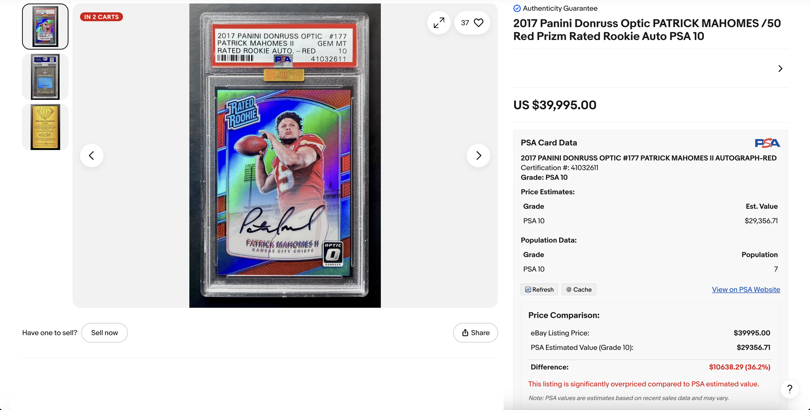

# PSA Certification Script



A browser userscript that enhances eBay listings for PSA-graded sports cards by fetching and displaying PSA certification data and price estimates.

## Features

### Core Functionality
- **Automatic Detection**: Intelligently finds PSA certification numbers on eBay listings using multiple methods
- **Smart Data Extraction**: Fetches and parses card data from the PSA website
- **Comprehensive Information Display**: Shows card details, grade, population data, and price estimates
- **Price Comparison**: Analyzes the eBay listing price against PSA's estimated value
- **Visual Recommendations**: Color-coded indicators show if a listing is overpriced or a good deal

### Advanced Features
- **Modal Interaction**: Automatically clicks "Check PSA data" buttons and extracts information
- **Modal Auto-Close**: Closes PSA data modals after extracting the necessary information
- **Manual Entry Option**: Allows entry of PSA certification numbers if automatic detection fails
- **Direct PSA Link**: Provides a link to the official PSA certification page

### Caching System
- **Data Caching**: Stores PSA data locally to improve performance and reduce server load
- **Cache Management UI**: Interface for viewing and managing cached data
- **Cache Expiration**: Automatically expires cached data after a configurable period
- **Cache Size Control**: Limits cache size and removes oldest entries when needed

### User Experience
- **Responsive Design**: Works well on different screen sizes and eBay layouts
- **Loading Indicators**: Shows loading state while fetching PSA data
- **Error Handling**: Provides helpful feedback if data cannot be retrieved
- **Customizable Settings**: Configure cache duration and other preferences

## Installation

1. Install a userscript manager extension for your browser:
   - [Tampermonkey](https://www.tampermonkey.net/) (recommended)
   - [Greasemonkey](https://www.greasespot.net/) (Firefox)
   - [Violentmonkey](https://violentmonkey.github.io/)

2. Install the script by:
   - Opening the raw `psa_certification.user.js` file and clicking "Install" when prompted by your userscript manager
   - Or copying the content of `psa_certification.user.js` and creating a new script in your userscript manager

## Usage

### Automatic Detection

1. Browse to any eBay listing for a PSA-graded card
2. The script will automatically:
   - Detect the PSA certification number from various locations on the page
   - If needed, click on "Check PSA data" buttons to reveal the certification number
   - Fetch data from the PSA website (or use cached data if available)
   - Display the information in a panel on the eBay page
   - Compare the eBay listing price with PSA's estimated value

### Manual Entry

If the script cannot automatically detect the PSA certification number:

1. A "Look Up" button will appear in a PSA data panel
2. Enter the PSA certification number (typically 8-10 digits found on the PSA label)
3. Click "Look Up" or press Enter
4. The script will fetch and display the PSA data

### Cache Management

The script includes a caching system to improve performance:

1. PSA data is cached locally for 7 days by default
2. Cached items are indicated with a "Cached" badge
3. Use the "🔄 Refresh" button to force a fresh fetch from PSA
4. Click the "⚙️ Cache" button to:
   - View when data was cached and when it expires
   - Clear all cached data

## How It Works

The script performs several sophisticated operations:

### 1. Initialization and Detection

- **Page Load Detection**: Waits for the eBay page to fully load before initializing
- **PSA Item Identification**: Checks if the listing is for a PSA-graded item before proceeding
- **Certification Number Detection**:
  - **Method 1**: Checks for key-value pairs containing certification numbers
  - **Method 2**: Looks for "Check PSA data" buttons and clicks them to reveal hidden data
  - **Method 3**: Searches item specifics sections for PSA certification numbers
  - **Method 4**: Examines title and description for certification numbers
  - **Method 5**: Uses a TreeWalker to find text containing PSA certification numbers
  - **Fallback**: Provides manual entry button if automatic detection fails

### 2. Data Retrieval and Caching

- **Cache Check**: First checks local cache for previously fetched data for the certification number
- **Cache Hit**: If found and not expired, uses cached data without making network requests
- **Cache Miss**: If not in cache or expired, proceeds with network request
- **Network Request**: Makes a request to the PSA website using the certification number
  - Uses primary URL format: `https://www.psacard.com/cert/{certNumber}/psa`
  - Falls back to alternative URL format if primary fails
- **Cross-Origin Handling**: Uses GM_xmlhttpRequest to bypass same-origin policy restrictions
- **Cache Storage**: Stores successfully fetched data in cache with timestamp and expiration
- **Cache Management**: Automatically cleans up old entries if cache size limit is reached

### 3. Data Extraction

- **HTML Parsing**: Uses DOMParser to convert raw HTML into a navigable document
- **Card Name Extraction**: 
  - Uses multiple selectors to find the card name
  - Falls back to generic approach for uppercase text that matches card name patterns
- **Grade Extraction**: 
  - Tries multiple selectors to find the grade
  - Falls back to text pattern matching if selectors fail
- **Price Data Extraction**:
  - Looks for price tables and extracts grade-to-price mappings
  - Falls back to searching for price elements with specific classes
  - As last resort, looks for currency patterns in relevant contexts
- **Population Data Extraction**:
  - Specifically targets links with format `<a class="text-hyperlink" data-testid="link" href="/pop/">`
  - Uses multiple fallback methods to find population counts
  - Employs proximity scoring to identify numbers likely to be population counts

### 4. Price Analysis and Comparison

- **eBay Price Detection**: 
  - Locates and extracts the current listing price
  - Handles different currency formats (US, European)
- **Grade Matching**: 
  - Identifies the current card's grade from multiple sources
  - Matches it with corresponding PSA price data
- **Difference Calculation**:
  - Computes absolute price difference
  - Calculates percentage difference relative to PSA value
- **Recommendation Generation**:
  - Categorizes listings as significantly overpriced (>20%), moderately overpriced (5-20%), 
    slightly higher, fairly priced, or good deal (below PSA value)
  - Provides color-coded recommendations based on the analysis

### 5. User Interface and Display

- **Data Container**: Creates a clean, formatted panel for displaying PSA data
- **Loading Indicators**: Shows spinner while fetching data
- **Information Sections**:
  - Card details section with name, certification number, and grade
  - Price data section with table of grade-to-price mappings
  - Population data section showing population counts
  - Price comparison section with analysis and recommendations
- **Cache Management UI**:
  - "Cached" badge for data loaded from cache
  - Refresh button to force fresh data fetch
  - Cache settings dropdown with timestamp information
  - Option to clear all cached data
- **Error Handling**: 
  - Displays user-friendly error messages
  - Provides retry button for failed requests
- **Strategic Placement**: 
  - Inserts the PSA data panel in optimal locations on the eBay page
  - Adapts to different eBay page layouts

## Technical Details

### Certification Number Detection

- **Multiple Detection Methods**: Uses five different techniques to find certification numbers
- **Key-Value Detection**: Specifically targets certification numbers in key-value pairs
- **Modal Interaction**: Automatically clicks "Check PSA data" buttons and extracts information
- **Context-Aware Search**: Looks for certification numbers in relevant contexts (near PSA mentions)
- **TreeWalker Implementation**: Uses efficient DOM traversal to find text nodes containing certification numbers
- **Regex Patterns**: Employs multiple regex patterns to identify different certification number formats

### Data Extraction Techniques

- **Multi-Selector Approach**: Tries multiple CSS selectors for each data element to handle website changes
- **Fallback Chain**: Implements cascading fallback methods for each data type
- **Currency Format Handling**: Properly parses different price formats (US, European)
- **Grade Detection**: Intelligently identifies the card's grade from multiple sources
- **Population Data Extraction**: Specifically targets population counts in various formats
- **Card Name Recognition**: Identifies card names in uppercase text and other formats
- **Proximity Scoring**: Ranks potential data elements by their proximity to relevant keywords

### Caching System Architecture

- **Local Storage**: Uses Tampermonkey's GM_setValue/GM_getValue API for persistent caching
- **Cache Entry Structure**: Stores data with metadata including timestamp and expiration
- **Expiration Control**: Automatically expires cached data after a configurable period (default: 7 days)
- **Size Management**: Limits cache size and removes oldest entries when needed
- **Cache Cleanup**: Performs automatic cleanup when adding new items to prevent excessive storage use
- **User Controls**: Provides UI for viewing cache status and clearing cache
- **Cache Indicators**: Visually indicates when data is loaded from cache

### User Interface Components

- **Responsive Design**: Works well on different screen sizes and eBay layouts
- **Visual Indicators**: Shows cached status, price comparisons, and recommendations
- **Loading Animation**: Displays animated spinner while fetching data
- **Error Handling**: Provides helpful feedback if data cannot be retrieved
- **Modal Management**: Automatically closes modals after extracting data
- **Strategic Placement**: Inserts UI elements in optimal locations based on page structure
- **Dropdown Menus**: Implements custom dropdown menu for cache settings
- **Event Handling**: Properly manages click events and document-level event listeners

### Error Handling and Debugging

- **Comprehensive Logging**: Includes detailed console logging for troubleshooting
- **Graceful Degradation**: Falls back to simpler methods when advanced methods fail
- **Try-Catch Blocks**: Wraps critical operations in try-catch blocks to prevent script crashes
- **User Feedback**: Provides clear error messages to users when issues occur
- **Retry Mechanism**: Includes retry button for failed requests
- **Alternative URL Formats**: Tries alternative URL formats when primary requests fail

### Performance Optimizations

- **Caching**: Reduces network requests through local data caching
- **Selective DOM Traversal**: Limits DOM traversal to relevant sections of the page
- **Efficient Selectors**: Uses specific CSS selectors to quickly find elements
- **Delayed Initialization**: Waits for page to fully load before running intensive operations
- **Throttled Operations**: Spaces out operations to avoid affecting page responsiveness
- **Resource Cleanup**: Properly removes event listeners and temporary elements

## Troubleshooting

- **No PSA Data Appears**: The script may not have found a valid certification number. Use the manual entry option.
- **Price Comparison Missing**: The script might not be able to determine the card's grade or match it with PSA data.
- **Data Looks Incorrect**: PSA's website structure may have changed. Try using the "Refresh" button to bypass the cache.
- **Script Not Working**: Check the browser console for error messages. The script includes extensive logging.

## Limitations

- The script relies on the structure of eBay and PSA websites, which may change over time
- Price estimates from PSA may not always be available for all cards
- The script requires permission to make cross-origin requests to the PSA website
- Some eBay listings may use non-standard formats that the script cannot parse

## Privacy and Security

- This script only accesses data on eBay listings and the PSA website
- Cached data is stored locally in your browser and is not shared
- No data is collected, stored, or transmitted to any third parties
- The script runs entirely in your browser

## Configuration

Advanced users can modify these settings at the top of the script:

```javascript
// Cache configuration
const CACHE_CONFIG = {
    // Cache expiration time in milliseconds (default: 7 days)
    expirationTime: 7 * 24 * 60 * 60 * 1000,
    
    // Maximum number of items to keep in cache
    maxItems: 100,
    
    // Cache key prefix
    keyPrefix: 'psa_cert_data_'
};
```

## Contributing

Feel free to submit issues or pull requests if you find bugs or have suggestions for improvements. Areas for potential enhancement include:

- Additional detection methods for certification numbers
- Support for other grading companies (BGS, SGC, etc.)
- Enhanced price history and trend analysis
- Mobile optimization
- User preferences interface

## License

This project is open source and available under the MIT License.