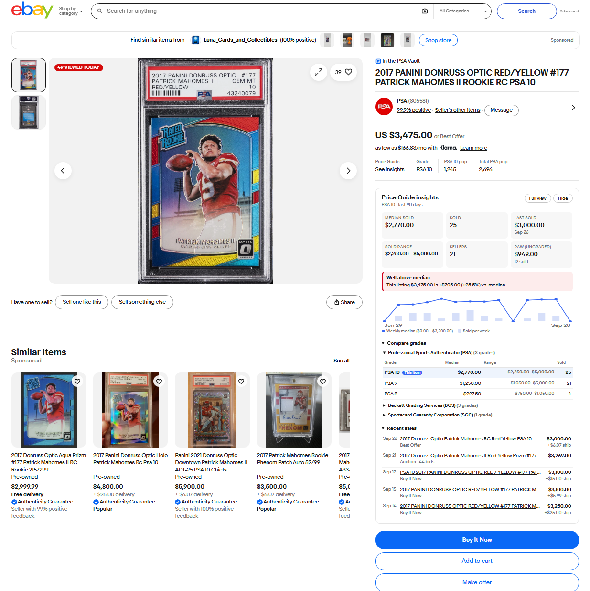

# eBay Price Guide Insights



A browser userscript for eBay trading card listings. eBay's **Price Guide** only shows its stats in a modal behind a "See insights" button. This script puts those stats in a panel on the listing page, so you never have to open the modal.

## Features

- **Key stats**: median sold price, number sold, last sold price and date, sold price range, number of sellers, and the raw (ungraded) median for the card
- **This listing vs. median**: how far the listing price is from the median, color coded:
  - 🟢 more than 5% below the median
  - 🔵 within 5% of the median
  - 🟠 5–20% above
  - 🔴 more than 20% above
- **Weekly trend chart**: median sold price by week, with sold-per-week bars (weeks with no sales are skipped)
- **Compare grades**: median, price range, and sold count for every grade from each grading company (PSA, BGS, CGC, SGC), with the listing's grade highlighted
- **Recent sales**: the latest sold listings, with links, sale format, and shipping cost
- **Full view** button to open eBay's own insights modal
- **Hide/Show** toggle that is remembered between pages

## Installation

1. Install a userscript manager extension for your browser:
   - [Tampermonkey](https://www.tampermonkey.net/) (recommended)
   - [Violentmonkey](https://violentmonkey.github.io/)
   - [Greasemonkey](https://www.greasespot.net/) (Firefox)
2. Install the script by either:
   - opening the raw [`ebay_price_guide.user.js`](ebay_price_guide.user.js) file and clicking "Install" when your userscript manager asks, or
   - copying the file's contents into a new script in your userscript manager.

## Usage

Open any eBay listing (`https://www.ebay.com/itm/...`) that shows a **Price Guide** row. The panel appears under the Price Guide / Grade / Pop row, or under the price if that row isn't on the page. Listings without Price Guide data are left unchanged.

## How it works

The "See insights" modal loads its data from a same-origin eBay endpoint:

```
https://www.ebay.com/wcs/get-market-data/listing-id?listingid=<listing id>
```

The script calls that endpoint directly with `fetch` when the page loads, then builds the panel from the JSON response:

| Panel section | Source in the response |
| --- | --- |
| Median sold, sold count | This grade's `priceGuidance` under `priceGuidanceByGradingCompany` |
| Sold range, sellers, trend, recent sales | `priceGuidance` (`recommendations`, `meta`, `metricsTrends`, `listings`) |
| Raw (ungraded) | `priceGuidanceByUngradedCondition` |
| This item's grader and grade | The listing's `itemCondition` descriptors |

## Configuration

These settings are at the top of the script:

```javascript
const CONFIG = {
    // Same-origin endpoint the "See insights" modal loads its data from
    marketDataUrl: '/wcs/get-market-data/listing-id?listingid=',

    // Give up on the market data request after this long (ms)
    requestTimeout: 15000,

    // Number of recent sales to show
    recentSalesLimit: 5,

    // How long to wait for the listing's right-hand panel to render (ms)
    anchorTimeout: 10000,

    // localStorage key for remembering the collapsed state
    collapsedKey: 'ebay_pg_insights_collapsed'
};
```

## Troubleshooting

- **No panel appears**: the listing probably has no Price Guide data (for example, a non-card item or a card eBay hasn't catalogued). Open the browser console and look for `[PG Insights]` messages.
- **Numbers look different from the modal**: click **Full view** to compare. Both read the same data, so a mismatch probably means eBay has changed the response format.

## Limitations

- The endpoint is undocumented and may change or disappear without notice. If it does, the panel won't appear.
- Only `www.ebay.com` listings are supported, and the listing price comparison assumes USD.

## Privacy and security

- The script only makes requests to eBay, the same request the "See insights" button makes. It needs no special userscript permissions (`@grant none`).
- The only thing it stores is the Hide/Show preference, in your browser's `localStorage`.
- No data is collected or sent to any third party.
- Listing text from eBay is HTML-escaped before it is displayed.

## History

This repo started as the **PSA Certification Script** (`psa_certification.user.js`), which scraped PSA's website for cert data and price estimates. It no longer works as expected, so this script has replaced it. The old version is still in the git history.

## License

This project is open source and available under the MIT License.
